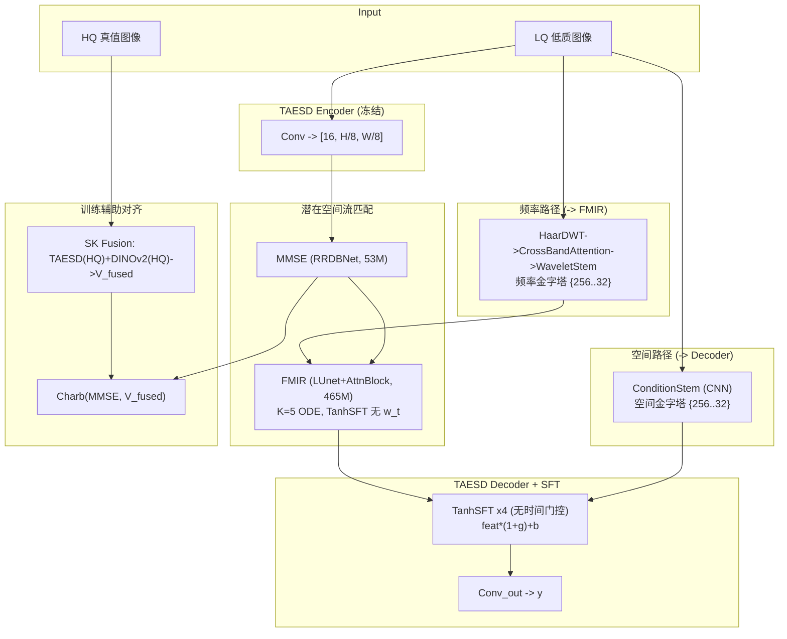
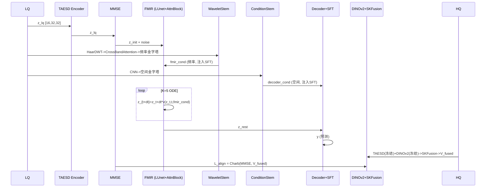

# ELIR 端到端训练管道技术文档

## 1. 整体架构（当前版本）



**核心设计**：频率/空间双路分离注入，不做融合。
- FMIR：纯频率金字塔（Wavelet + CrossBandAttention）
- Decoder：纯空间金字塔（CNN ConditionStem）
- TanhSFT 去掉时间系数 w_t，时间调制保留在 ResnetBlock2D.time_mlp

## 2. 数据流



## 3. 模块详解

### 3.1 HaarDWT2D

4 个固定 2x2 卷积核，stride=2，零参数：
```
LL:平均 LH:水平 HF HL:垂直 HF HH:对角 HF
LQ [3,256,256] -> {LL,LH,HL,HH} 各 [3,128,128]
```

### 3.2 CrossBandAttention

4 个子带 12 通道拼接 -> 共享 MLP -> 4xSigmoid 权重。bias=2 初始化 (Sigmoid(2)~0.88)。Sigmoid 非 Softmax，不互斥。参数 ~200。
**有效**：全训练 RESIDE +2.44 dB。

### 3.3 WaveletStem

加权子带 cat [12,128,128] -> proj -> [16,128,128] -> {to_256,to_128,to_64,to_32} 多尺度金字塔。
输出 {256:16ch, 128:32ch, 64:64ch, 32:64ch} 频率条件，注入 FMIR SFT。

### 3.4 ConditionStem (CNN 空间金字塔)

```python
Conv2d(3->16,3x3)+SiLU + Conv2d(16->16,3x3)+SiLU -> [16,256,256]
-> downsample -> {16:256, 32:128, 64:64}
```

输出空间条件金字塔，注入 Decoder SFT。

### 3.5 TanhSFT（当前版本，无时间门控）

```python
h = Shared(cond)           # Conv3x3 + SiLU
g = tanh(g_head(h)) * scale
b = tanh(b_head(h)) * scale
feat = feat * (1 + g) + b
```

| 位置 | scale |
|---|---|
| FMIR 内部 | 0.2 |
| Decoder | 0.1 |

g/b head Conv 零初始化，训练第 0 步恒等。w_t 已移除，时间信息由 ResBlock.time_mlp(t_emb) 承载。

### 3.6 FMIR (LUnet + CGFM + AttnBlock)

```
ch_mult=[1,2,2,2], hid=192
Level 0: 192ch, 32x32
Level 1: 384ch, 16x16
Level 2: 768ch, 8x8
Level 3: 1536ch, 4x4
瓶颈: ResnetBlock2D x4 @1536ch + AttnBlock (8-head, 16token, 192dim/head)
上采样: 逆序 + skip connections (含 DWT Skip)

CGFM 条件注入: 频率金字塔 -> TanhSFT 注入 FMIR 各层
```

**AttnBlock**: GroupNorm -> QKV(1x1,1536->4608) -> 8-head Scaled Dot-Product Attention -> Proj+residual。16 token 全局交互。

**ResBlock.time_mlp**: t_emb -> SiLU -> Linear -> affine 调制，K 步 ODE 每步动态调整。

```
#### 1.物理视角的“时不变性” (Time-Invariance of Priors)

“首先是物理逻辑。流匹配（Flow Matching）的 ODE 轨迹是在逐步改变**生成的潜变量 $z_t$**，但我们的条件输入 $x_{lq}$（极暗光原图）是**客观存在、绝对静态的先验**。

$x_{lq}$ 的物理频带结构——它的水平边缘（LH）、垂直边缘（HL）和全局低频（LL）——是图像固有的属性，绝对不会因为我们 ODE 积分走到了哪一步而发生改变。因此，负责提取先验特征的 `WaveletStem` 必须像一面镜子，忠实、全景地反映 LQ 图像的静态物理属性，而不该随时间波动。”

#### 2. “信息提取”与“信息使用”的绝对解耦 (Separation of Concerns)

“我们采用了一种‘全景菜单’与‘按需点菜’的解耦哲学：

- **WaveletStem 是菜单：** 它通过 HaarDWT 提供 100% 完整的高低频全景信息（LL, LH, HL, HH）。

- **FMIR (U-Net) 是食客：** U-Net 内部的 `ResnetBlock2D` 是带有 `time_mlp(t_emb)` 的。U-Net 看到这份全景菜单后，会根据自己当前所处的时间 $t$，**自主决定**该提取哪些频率。

  在 $t \to 0$（去噪初期），U-Net 内部的仿射变换会自动放大对 LL（低频全局光照）的注意力；在 $t \to 1$（纹理重建期），它会自动去抓取 LH/HL/HH（高频细节）。**频率的权重其实变了，只不过变化发生在使用端（U-Net内部），而不是提取端（小波层）。**”

#### 3. 避免不可逆的“信息早夭” (Preventing Information Bottleneck)

“如果我们在小波层引入时间 $t$ 去压制特征，这在信息论上是非常危险的。

假设在 $t=0$ 时，前端小波层把高频权重设为 $0.01$，这就相当于在条件金字塔中**物理抹杀**了高频信息。当 ODE 走到 $t=0.5$，U-Net 可能突然需要一点中高频信息来辅助边缘定位，但此时条件特征图里已经没有高频信号了。保留静态的全频带条件，能够给予 U-Net 最大的感受野自由度，防止信息在进入主干网络前被‘提前阉割’。”

#### 4. 消除计算冗余 (Computational Efficiency)

“最后是工程实现的考量。在我们的框架中，ODE 积分需要走 $K=5$ 步。如果 `WaveletStem` 随 $t$ 变化，意味着每走一步，我们都要把同一张 LQ 图像重新做一次 DWT 分解，再过一遍多层 CNN 提取特征金字塔。这会带来巨大的计算冗余。将条件提取静态化，我们在循环外只需计算一次，极大提升了推理速度，特别适合我们在算力受限情况下的高效复原。”
```

**流匹配 ODE**:

```
训练: z_t = (1-(1-s_min)t)(z_lq+noise) + t*z_hq
      L_CFM = Charb(f0,f0_) + alpha*Charb(v0,v0_)

推理: z_0 = MMSE(z_lq) + noise
      z_{t+dt} = z_t + dt*FMIR(z_t,t,fmir_cond)
```

### 3.7 AttnBlock（瓶颈自注意力）

```
GroupNorm(32,1536) -> QKV(1x1) -> chunk(3) -> [B,8,16,192]
-> Scaled Dot-Product -> Proj + residual
16x16 QK 矩阵, ~0.1ms.
LOL 有效 (+0.38 过拟合), RESIDE 无效 (-1.03)。
```

### 3.8 DWT Skip Connection（浅层频带增强）

Encoder 浅层 (32x32,16x16) skip -> HaarDWT -> 高频 conv(残差) -> IWT 重建。
zero-init 等价标准 skip，~0.08 dB 中性辅助模块。

### 3.9 SK Fusion：TAESD + DINOv2 双路自适应融合

```
HQ -> TAESD_enc(冻结) -> U_taesd [16,32,32]
HQ -> DINOv2(冻结) -> DinoSpatialProjector -> U_dino [16,32,32]
U_sum = U_taesd + U_dino -> GAP -> FC(32->4->32) -> Softmax -> a,b
V_fused = a*U_taesd + b*U_dino (逐通道自适应)

L_align = Charb(MMSE(LQ), V_fused.detach())
```

bias=[3,-3] 初始化：训练初期 a>>b，优先信任 TAESD。推理不参与。过拟合 +0.11 dB。

### 3.10 NLayerDiscriminator

SpectralNorm + Hinge Loss。当前 lambda_gan=0（关闭）。

### 3.11 已废弃模块

| 模块 | 原因 | 处理 |
|---|---|---|
| TimeGatedDilatedConv | LOL -0.35~-1.28, RESIDE -0.40 | 代码保留, use_time_dilate:false |
| TimeBandWeight (t->子带权重) | 静态条件+时间门控矛盾 | 代码保留, time_cond:false |
| GroupNorm (Encoder) | 小数据无效 | enc_trainable:false |
| Encoder 可训练 (小数据) | 过拟合 | enc_trainable:false |
| CondFusion1x1 双路融合 | 分离路径更优 | 代码保留, forward 不再调用 |

## 4. 损失函数

### 4.1 FM 潜在空间损失 (L_fm, w=1.0)

```python
X_hq = TAESD_enc(HQ).detach()      # 冻结教师模型编码
X_lq = TAESD_enc(LQ)
X_mmse = MMSE(X_lq)

L_mmse = Charb(X_hq, X_mmse)        # MMSE 初始估计监督

# CFM (w=0.999)
t ~ U(0,1-dt), eps ~ N(0,I)
z_t = (1-(1-s_min)*t)*(X_mmse.detach()+noise) + t*X_hq
v_pred = FMIR(z_t, t, fmir_cond)
L_cfm = Charb(f0,f0_) + alpha*Charb(v_pred, v0_alt)

# ODE 终点 (w=0.001)
f1 = f0.detach()                     # 梯度截断
L_end = Charb(X_hq, f1+(1-seg_end)*v1_final)
```

Charbonnier: `mean(sqrt((x-y)^2+1e-6))`。alpha=0.001, beta=0.001。

### 4.2 表示对齐损失 (L_dino / L_sk)

```python
# SK Fusion 模式 (sk_fusion:true)
V_fused = SKFusion(TAESD_enc(HQ), DinoSpatialProj(DINOv2(HQ)))
L_align = 0.1 * Charb(MMSE(LQ), V_fused.detach())

# 旧版 DINO 对齐 (dino_align:true, sk_fusion:false)
L_dino = 0.1 * MSE(DINOProjector(MMSE), DINOv2(HQ).detach())
```

### 4.3 像素空间损失 (x lambda_pix)

```python
y = Decoder(z_rest, decoder_cond)
L_charb = Charb(y, HQ)                                      # w=1.0
L_ssim  = 1.0 - SSIM(y,HQ)                                  # w=0.5
L_color = mean(1-cos_sim(y,HQ,dim=1))                       # w=0.05
L_blur  = Charb(GaussianBlur(y,21), GaussianBlur(HQ,21))    # w=0.05
```

### 4.4 总损失与 Warmup

```
G_loss = L_fm + lambda_align*L_align
       + lambda_pix*(1.0*L_charb + 0.5*L_ssim + 0.05*L_color + 0.05*L_blur)

lambda_pix:  0->0.5 (10k步)
lambda_align: 0->0.1 (20k步, 可选)
```

### 4.5 梯度流

```
L_mmse -> MMSE -> Enc(LQ)
L_cfm  -> FMIR (Xt, v_pred)
L_end  -> FMIR (f1.detach 截断: 像素损失不回传 FMIR)
L_align -> MMSE (V_fused.detach: HQ 侧冻结)
L_pix  -> Decoder+SFT+WaveletStem
```

## 5. 训练策略

| 参数 | 值 |
|---|---|
| Batch Size | 1-4 |
| 梯度累积 | 1-4 |
| G lr / D lr | 1e-4 / 4e-5 |
| LR 调度 | Cosine 退火 (lr -> lr*0.01) |
| EMA Decay | 0.999 |
| 梯度裁剪 | 1.0 (L2 norm) |
| 精度 | FP32 |

手动优化 (Lightning manual optimization)，G/D 交替更新，梯度累积 + Cosine LR 手动实现。

## 6. 推理流程

```
LQ -> TTA?(8种几何变换) -> Enc -> MMSE -> FMIR ODE(K=10~15) -> Dec+SFT
                        -> 逆变换+像素平均 -> Clamp(0,1) -> y

训练 K=5, 推理 K=10(去雾最优)/K=15(低光最优)
TTA 可选, +0.15-0.3 dB
```

## 7. 评估指标

DiffUIR MATLAB 兼容 PSNR/SSIM：
- 8-bit 量化: x255 -> round -> uint8
- YCbCr Y 通道 (ITU-R BT.601)
- SSIM: cv2.GaussianKernel(11,1.5), BORDER_REPLICATE
- PSNR: 20*log10(255/sqrt(MSE))

## 8. 参数量分布

| 模块 | 参数量 | 状态 |
|---|---|---|
| TAESD Encoder | 1.2M | 冻结 |
| MMSE (RRDBNet) | 52.9M | 可训练 |
| FMIR (LUnet+AttnBlock) | 465M | 可训练 |
| TAESD Decoder+SFT | 1.6M | 可训练 |
| WaveletStem+CrossBandAttn | ~0.1M | 可训练 |
| DWT Skip Enhance x2 | ~5K | 可训练 |
| DINOv2 ViT-B/14 | 86.6M | 冻结 |
| DinoSpatialProjector+SKFusion | ~15K | 可训练 |
| NLayerDiscriminator | 1.7M | 可训练 (lambda_gan=0) |
| **总计可训练** | ~520M | |
| **总计冻结** | ~88M | |

## 9. 实验结果

### 9.1 RESIDE 去雾

| 版本 | PSNR | SSIM | FID |
|---|---|---|---|
| 两阶段 baseline | 29.24 | 0.971 | 13.89 |
| 端到端 | 30.58 | 0.981 | 6.22 |
| +K=10 | 30.93 | 0.982 | 5.44 |
| **+CrossBandAttention** | **31.68** | **0.981** | **4.80** |

### 9.2 LOL 低光增强

| 版本 | PSNR | SSIM |
|---|---|---|
| 最佳 (从头训, Attn+DINO+CBandAttn, K=15+TTA) | 25.13 | 0.910 |
| 去掉 FMIR | 15.97 | 0.832 |
| 去掉 MMSE | 16.79 | 0.679 |

### 9.3 LOL 过拟合消融 (1000 步)

| 配置 | PSNR | vs Baseline |
|---|---|---|
| Baseline | 18.89 | - |
| Attention only | 19.26 | +0.38 |
| DWT Skip | 18.94 | +0.05 |
| SK Fusion | 19.00 | +0.11 |
| TimeDilate only | 16.94 | -0.35 |
| Split path | 17.25 | 持平 |

### 9.4 RESIDE 过拟合消融 (200 步)

| 配置 | PSNR | vs Baseline |
|---|---|---|
| Baseline / Enc / DINOv2 | 21.04 | ~0 |
| TimeDilate | 20.63 | -0.40 |
| Attention only | 20.01 | -1.03 |

### 9.5 关键结论

| 模块 | LOL | RESIDE | 判决 |
|---|---|---|---|
| CrossBandAttention | +2.44 dB | +1.10 dB | **有效** |
| AttnBlock | +0.38 | -1.03 | 仅小数据有效 |
| DWT Skip | +0.08 | 未测 | 中性辅助 |
| SK Fusion | +0.11 | 未测 | 优于纯 DINO |
| TimeDilate | -0.35~-1.28 | -0.40 | **无效** |
| DINOv2 对齐 | +0.02 (从头训) | ~0 | 仅小数据有效 |
| Encoder 可训练 | ~0 | ~0 | 小数据禁用 |
| GroupNorm | 短期+0.14, 长期无效 | ~0 | 禁用 |

## 10. 配置文件

| 文件 | 用途 |
|---|---|
| `elir_train_e2e_large.yaml` | RESIDE 训练 |
| `elir_train_e2e_large_lol.yaml` | LOL 训练 |
| `elir_eval_e2e_large.yaml` | RESIDE 评估 |
| `elir_eval_e2e_large_lol.yaml` | LOL 评估 |
| `elir_eval_*_abl_fmir.yaml` | 消融: 去掉 FMIR |
| `elir_eval_*_abl_mmse.yaml` | 消融: 去掉 MMSE |
| `overfit_tests/*.yaml` | 快速过拟合验证 (10 个) |

## 11. 训练前检查清单

1. `enc_cfg.trainable: false`
2. `use_time_dilate: false`
3. `band_attn: true`, `fmir_use_wavelet_cond: true`
4. `k_steps: 5` (训练), `10~15` (推理)
5. `save_weights_only: true`
6. teacher_cfg 设为冻结 TAESD
7. eval config 架构参数与训练 config 一致
