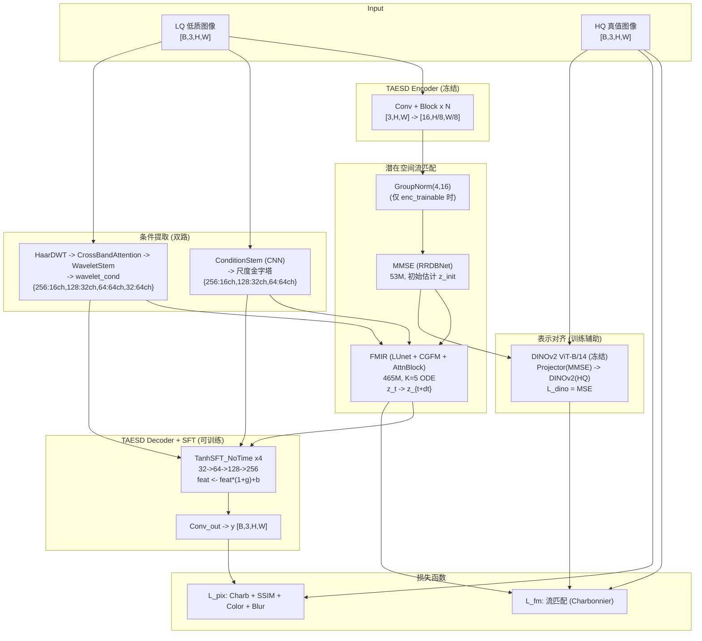
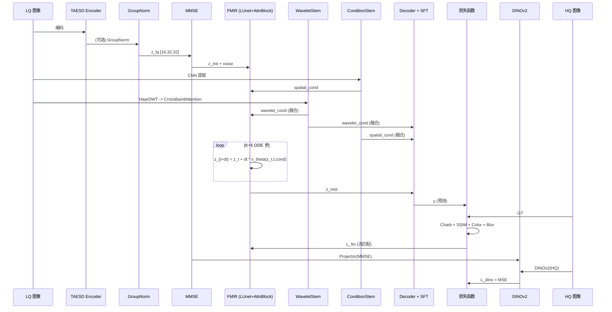
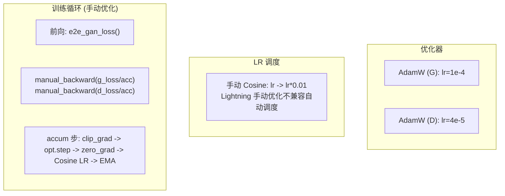
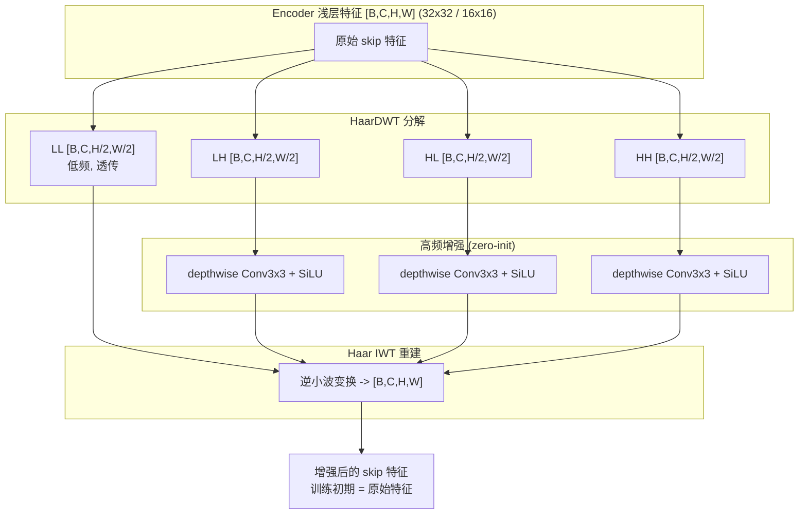

# ELIR 端到端训练管道技术文档

## 1. 整体架构



## 2. 数据流详解



## 3. 模块详解

### 3.1 HaarDWT2D（零参数频带分解）

4 个固定 2x2 卷积核，stride=2 分组卷积，零学习参数。

```
LL: [+1+1;+1+1]/2    低频（全局光照、颜色）
LH: [+1+1;-1-1]/2    水平高频
HL: [+1-1;+1-1]/2    垂直高频
HH: [+1-1;-1+1]/2    对角高频

LQ [3,256,256] -> {LL,LH,HL,HH} 各 [3,128,128]
```

### 3.2 CrossBandAttention（跨频带全局门控）

- 拼接 4 个子带 12 通道 -> 共享 MLP 输出 4 个 Sigmoid 权重
- Sigmoid 非 Softmax：不互斥，允许多频带同时高激活
- bias 初始化=2：Sigmoid(2)~0.88，训练初期接近恒等
- 参数量：~200
- **有效**：过拟合测试 PSNR +0.38 (LOL), 全训练 +2.44 (RESIDE)

### 3.3 WaveletStem（多尺度金字塔投影）

```
加权频带 cat -> [12, 128, 128]
    proj (Conv3x3+SiLU) x2 -> [16, 128, 128]
    to_256 (^2x) -> [16, 256, 256]
    to_128 (3x3) -> [32, 128, 128]
    to_64  (stride=2) -> [64, 64, 64]
    to_32  (stride=2) -> [64, 32, 32]
```

4 个尺度通道数 {16,32,64,64} 与 FMIR condition_stem 金字塔对齐。

### 3.4 CondFusion1x1（双路条件融合）

```
spatial_cond [C_s, H, W] + wavelet_cond [C_w, H, W]
    -> Concat -> Conv1x1(C_s+C_w -> C_out) -> fused_cond

初始化: weight=0, bias=0, 前 C_s 通道 identity bias=1.0
```

训练初期 spatial_cond 原样通过，逐步学习混合 wavelet_cond。

### 3.5 TanhSFT / TanhSFT_NoTime（特征调制）

```python
h = Shared(cond)           # Conv3x3 + SiLU
g = tanh(g_head(h)) * scale
b = tanh(b_head(h)) * scale
feat = feat * (1 + g) + b
```

| 位置 | scale | 说明 |
|---|---|---|
| FMIR 内部 (TanhSFT) | 0.2 | 调制 U-Net 特征, 含时间权重 w_t |
| Decoder (TanhSFT_NoTime) | 0.1 | 调制解码器特征, 无时间参数 |

g/b head Conv 零初始化，训练第 0 步恒等。

### 3.6 FMIR (LUnet + CGFM + AttnBlock)

```
下采样: ch_mult=[1,2,2,2], hid=192
  Level 0: 192ch, 32x32
  Level 1: 384ch, 16x16
  Level 2: 768ch, 8x8
  Level 3: 1536ch, 4x4

瓶颈: ResnetBlock2D x4 @ 1536ch + AttnBlock (8-head Self-Attn)
      16 token, 192 dim/head

上采样: 逆序 + skip connections

CGFM 条件: CNN ConditionStem -> 尺度金字塔 -> 注入 SFT 层
           + Wavelet cond (fmir_cond_fusions 融合后注入)
```

**AttnBlock（瓶颈自注意力）**:

```
GroupNorm(32,1536) -> QKV(1x1, 1536->4608) -> chunk(3)
-> Reshape [B,8,16,192] -> Scaled Dot-Product -> Proj + residual

16 token x 16 token QK 矩阵, 开销 ~0.1ms
```

小数据任务 (LOL): 有效 (+0.38 dB 过拟合, +0.02 全训练)
大数据任务 (RESIDE): 无效 (-1.03 dB 过拟合)

**TimeGatedDilatedConv（已放弃）**:

```
t_emb -> MLP -> C-dim Sigmoid gate x DilatedConv(3x3, dilation=3)
残差旁路: out = main_conv + gate * dilated_conv
bias=-5 零初始化
```

过拟合测试: LOL -0.35, RESIDE -0.40。全训练: LOL -1.28。
结论: K=5 短 ODE 不需要粗到细感受野切换。保留代码但不启用。

**流匹配 ODE**:

```
训练: z_t = (1-(1-s_min)*t)*(z_lq+noise) + t*z_hq
      L_CFM = Charb(FMIR(z_t,t,cond), z_hq - ...)

推理: z_0 = MMSE(z_lq) + noise
      for t in [0,dt,...,1-dt]:
        z_{t+dt} = z_t + dt * FMIR(z_t,t,cond)
```

### 3.7 DINOv2 表示对齐

```
HQ -> DINOv2 ViT-B/14 (冻结, 87M) -> patch_tokens [B,256,768]
MMSE(z_lq) -> DINOProjector (可训, ~50K) -> [B,256,768]
L_dino = lambda_dino * MSE(projected, dino_tokens)

lambda_dino: 0.1 (LOL), 0.0 (RESIDE)
```

RESIDE 上无效（过拟合测试 21.03 ~ baseline 21.04）。
LOL 从头训时等效替代 RESIDE 预训练语义先验 (+0.02)。

### 3.8 NLayerDiscriminator

```
Conv(3->64, S=2) + LeakyReLU
Conv(64->128, S=2) + SpectralNorm + LeakyReLU
Conv(128->256, S=2) + SpectralNorm + LeakyReLU
Conv(256->256, S=1) + SpectralNorm + LeakyReLU
Conv(256->1, S=1) + SpectralNorm

输出: [B,1,H,W] 逐 patch 真伪 logits, 感受野 70x70
Hinge Loss, 当前 lambda_gan=0 (关闭)
```

## 4. 损失函数

### 4.1 FM 潜在空间损失 (L_fm)

流匹配训练的损失通过三个子项实现，全部使用 Charbonnier (eps=1e-3):

```python
# 1. MMSE 初始估计 (weight=1.0)
X_hq = TAESD_enc(HQ).detach()     # HQ -> 潜编码, no_grad
X_lq = TAESD_enc(LQ)              # LQ -> 潜编码
X_mmse = MMSE(X_lq)               # MMSE 初始估计
L_mmse = Charb(X_hq, X_mmse)      # -> MMSE 梯度

# 2. CFM 条件流匹配 (weight=1-beta=0.999)
t ~ U(0, 1-dt), eps ~ N(0, I)
z_t = (1-(1-s_min)*t) * (X_mmse.detach()+noise) + t * X_hq
v_pred = FMIR(z_t, t_emb, cond)    # 预测向量场
L_cfm = Charb(f0, f0_) + alpha*Charb(v_pred, v0_alt)

# 3. ODE 终点约束 (weight=beta=0.001)
f1 = f0.detach()                   # <- 梯度截断点
X1 = f1 + (1 - seg_end) * FMIR(f1, ...)
L_end = Charb(X_hq, X1)
```

**Charbonnier**: `Charb(x,y) = mean(sqrt((x-y)^2 + 1e-6))`, 比 L1 光滑, 比 L2 抗异常值。

### 4.2 DINOv2 表示对齐 (L_dino)

```python
dino_hq = DINOv2(HQ)                        # [B,256,768], 冻结, no_grad
dino_mmse = DINOProjector(X_mmse)            # [B,256,768], 可训 ~50K 参数
L_dino = MSE(dino_mmse, dino_hq.detach())   # lambda=0.1 (LOL) / 0.0 (RESIDE)
```

DINOProjector: `Conv3x3(16->128)->SiLU->Conv3x3(128->256)->SiLU->Conv3x3(256->768)`, 下采样至 16x16。

### 4.3 像素空间损失

```python
y = Decoder(X1, cond)              # 潜在 -> RGB
y, HQ = clamp(y,0,1), clamp(HQ,0,1)

# 4.3.1 Charbonnier (w=1.0)
L_charb = Charb(y, HQ)

# 4.3.2 SSIM (w=0.5)
# DiffUIR MATLAB 兼容: cv2.GaussianKernel(11,1.5)+BORDER_REPLICATE
L_ssim = 1.0 - SSIM(y, HQ)

# 4.3.3 余弦颜色 (w=0.05) - 逐像素 RGB 3D 向量夹角, 惩罚偏色
L_color = mean(1 - cos_sim(y, HQ, dim=1))

# 4.3.4 模糊颜色一致性 (w=0.05) - 高斯模糊(kernel=21)去纹理, 保留全局亮度
L_blur = Charb(GaussianBlur(y,21), GaussianBlur(HQ,21))
```

### 4.4 总损失与 Warmup

```
G_loss = L_fm
       + lambda_dino * L_dino
       + lambda_pix * (
             1.0*L_charb + 0.5*L_ssim + 0.05*L_color + 0.05*L_blur
         )

lambda_pix:  0 -> 0.5  (warmup 10k步)
lambda_dino: 0 -> 0.1  (warmup 20k步, LOL only)
```

| 损失项 | 权重 | 作用域 | 梯度流向 |
|---|---|---|---|
| L_mmse | 1.0 | 潜空间 | MMSE -> Enc(LQ) |
| L_cfm | 0.999 | 潜空间 | FMIR |
| L_end | 0.001 | 潜空间 | FMIR (X1.detach 截断) |
| L_dino | 0.1 (LOL) | 潜空间 | DINOProjector -> MMSE |
| L_charb | 1.0 x l_pix | 像素空间 | Decoder+SFT+WaveletStem |
| L_ssim | 0.5 x l_pix | 像素空间 | 同上 |
| L_color | 0.05 x l_pix | 像素空间 | 同上 |
| L_blur | 0.05 x l_pix | 像素空间 | 同上 |

**关键截断**: `f1 = f0.detach()` — 像素损失不通过 FMIR 回传，防止 ODE 路径 + Decode 路径双梯度叠加爆炸。

## 5. 训练策略



| 参数 | 值 |
|---|---|
| Batch Size | 1-4 |
| 梯度累积 | 1-4 |
| 混合精度 | FP32 |
| EMA Decay | 0.999 |
| 梯度裁剪 | 1.0 (L2 norm) |
| Cosine LR | lr -> lr*0.01 |
| 最大步数 | 50000 (LOL) / 300000 (RESIDE) |

## 6. 推理流程

```
LQ -> TTA? -> 8 种几何变换 (原图+flip+transpose 组合)
         -> 推理: Enc -> [GN] -> MMSE -> FMIR ODE(K) -> Dec+SFT
         -> 逆变换 + 像素平均
         -> Clamp(0,1) -> 输出

训练 K=5, 推理 K=10 (去雾最优) / K=15 (低光最优)
TTA 可选, 零成本涨 0.15-0.3 dB
```

## 7. 评估指标

PSNR/SSIM 使用 DiffUIR MATLAB 兼容实现：

- 8-bit 量化: x255 -> round -> uint8
- YCbCr Y 通道 (ITU-R BT.601)
- SSIM: cv2.getGaussianKernel(11,1.5), BORDER_REPLICATE
- PSNR: 20*log10(255/sqrt(MSE))

与学术界所有主流方法直接可比。

## 8. 参数量分布

| 模块 | 参数量 | 状态 |
|---|---|---|
| TAESD Encoder | 1.2M | 冻结 |
| MMSE (RRDBNet) | 52.9M | 可训练 |
| FMIR (LUnet + AttnBlock) | 465M | 可训练 |
| TAESD Decoder + SFT | 1.6M | 可训练 |
| WaveletStem + CrossBandAttention | ~0.1M | 可训练 |
| DINOProjector | ~50K | 可训练 |
| CondFusion1x1 (fmir+dec) x8 | ~20K | 可训练 |
| NLayerDiscriminator | 1.7M | 可训练 |
| DINOv2 ViT-B/14 | 86.6M | 冻结 |
| LPIPS (AlexNet) | 2.5M | 冻结 |
| **总计可训练** | **~520M** | |
| **总计冻结** | **~92M** | |

## 9. 实验结果

### 9.1 RESIDE 去雾

| 版本 | PSNR | SSIM | FID | 关键改动 |
|---|---|---|---|---|
| 两阶段 baseline | 29.24 | 0.971 | 13.89 | Stage1 FMIR + Stage2 SFT |
| 端到端 (e2e) | 30.58 | 0.981 | 6.22 | FMIR+Decoder 联合 |
| +K=10 推理 | 30.93 | 0.982 | 5.44 | ODE 步数翻倍 |
| **+CrossBandAttention** | **31.68** | **0.981** | **4.80** | FMIR+Decoder 频带感知门控 |

### 9.2 LOL 低光增强

| 版本 | PSNR | SSIM | 关键配置 |
|---|---|---|---|
| 最佳 (从头训) | 25.13 | 0.910 | Attn + DINO + CBandAttn, K=15, TTA |
| 去掉 FMIR (消融) | 15.97 | 0.832 | 仅 MMSE |
| 去掉 MMSE (消融) | 16.79 | 0.679 | 仅 FMIR |

### 9.3 过拟合快速消融 (200 步, 5 分钟/轮)

**LOL:**

| 配置 | PSNR | vs Baseline |
|---|---|---|
| Attention only | **17.67** | +0.38 |
| Baseline | 17.29 | - |
| Enc+GN | 17.26 | -0.03 |
| Enc no GN | 17.12 | -0.17 |
| TimeDilate only | 16.94 | -0.35 |
| DWT Skip (修正后) | 18.96 | -0.33 (200步), +0.08 (1000步) |

**RESIDE:**

| 配置 | PSNR | vs Baseline |
|---|---|---|
| Enc no GN | 21.04 | ~0 |
| Enc+GN | 21.04 | ~0 |
| Baseline | 21.04 | - |
| TimeDilate | 20.63 | -0.40 |
| Attention only | 20.01 | -1.03 |
| DINOv2 | 21.03 | ~0 |

### 9.4 关键结论

| 模块 | LOL | RESIDE | 判决 |
|---|---|---|---|
| CrossBandAttention | +2.44 dB (全训练) | +1.10 dB (全训练) | **有效** |
| Attention (瓶颈) | +0.38 (小数据) | -1.03 (大数据) | 仅小数据有效 |
| TimeGatedDilatedConv | -0.35 ~ -1.28 | -0.40 | **无效** |
| Encoder 可训练 | ~0 | ~0 | **不在小数据上使用** |
| DINOv2 对齐 | +0.02 (从头训) | ~0 | 仅小数据有效 |
| DWT Skip (浅层) | +0.08 (1000步) | 未测试 | 中性，可留做辅助 |
| GroupNorm | 短期 +0.14, 长期无效 | ~0 | 仅 Enc 可训练时使用 |

### 3.10 DWT Skip Connection（浅层频带增强）



仅在 U-Net 最浅两层 skip（32x32 和 16x16）启用，深层（8x8、4x4）保持不变。

- **零初始化**：高频 Conv weight=0, bias=0, 训练初期等价标准 skip
- **深度可分离**：groups=channels, 每层参数量仅 C*3*3
- **无时间条件**：纯静态频带增强, 不依赖 t_emb
- **1000 步过拟合**：PSNR +0.08 vs baseline, 中性模块

## 10. 配置文件

### 当前配置 (configs/)

| 文件 | 用途 |
|---|---|
| `elir_train_e2e_large.yaml` | RESIDE 去雾训练 |
| `elir_train_e2e_large_lol.yaml` | LOL 低光训练 |
| `elir_eval_e2e_large.yaml` | RESIDE 评估 (use_tta=true) |
| `elir_eval_e2e_large_lol.yaml` | LOL 评估 (K=15, use_tta=true) |
| `elir_eval_*_abl_fmir.yaml` | 消融: 去掉 FMIR |
| `elir_eval_*_abl_mmse.yaml` | 消融: 去掉 MMSE |

### 快速过拟合测试 (configs/overfit_tests/)

| 文件 | 测试变量 |
|---|---|
| `baseline.yaml` | 基础架构 (无 Attention/TimeDilate/Enc/DINO) |
| `attn_only.yaml` | 仅开启瓶颈注意力 |
| `dilate_only.yaml` | 仅开启时间门控空洞卷积 |
| `enc_only_gn.yaml` | 仅 Encoder 可训练 (含 GroupNorm) |
| `enc_only_nogn.yaml` | 仅 Encoder 可训练 (无 GroupNorm) |
| `*_reside.yaml` | 同上, RESIDE 数据集 |

## 11. 训练前验证清单

1. `enc_cfg.trainable: false` — Encoder 不训 (小数据)
2. `use_time_dilate: false` — 已证无效
3. `mmse.overparametrization: true` — 53M, 不砍
4. `k_steps: 5` 训练, `k_steps: 10-15` 推理
5. `use_attn: true` — 小数据开, 大数据关
6. `dino_align: true` — 小数据开, 大数据关
7. `save_weights_only: true` — 节省磁盘
8. eval config 架构参数与训练 config 完全一致
